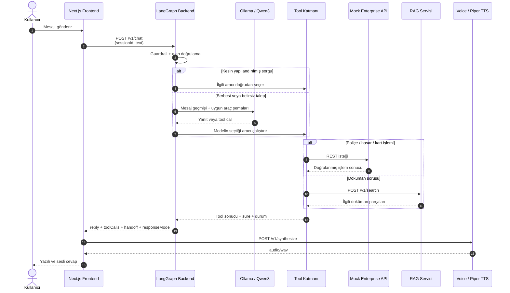
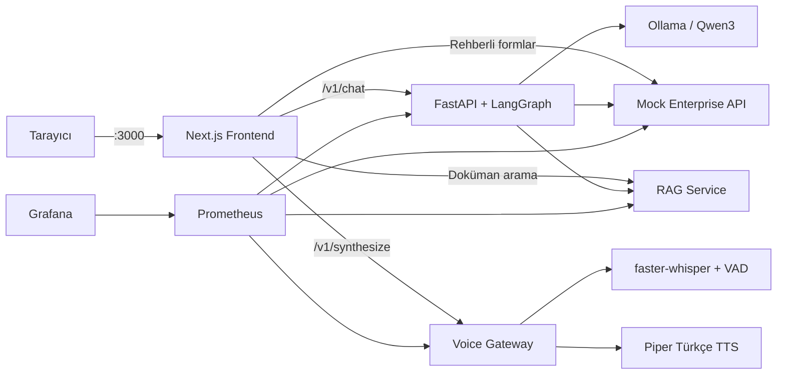

# FinVoice Ops

FinVoice Ops; bankacılık ve sigorta müşteri operasyonlarını yerel bir yapay
zekâ, kurumsal servis araçları ve Türkçe ses üretimiyle birleştiren uçtan uca
bir demo platformudur. Kullanıcı poliçe, hasar ve kart işlemlerini doğal dille
sorar; LangGraph konuşmayı yönetir, gerekli kurumsal API'yi çağırır ve
doğrulanmış sonucu Piper ile seslendirir.

Proje ücretli bir yapay zekâ API'sine ihtiyaç duymaz. LLM olarak Ollama
üzerinde `qwen3:1.7b`, ses üretiminde Türkçe Piper modeli ve doküman aramasında
yerel TF-IDF + FAISS kullanılır.

## İçindekiler

- [Şu anda neler çalışıyor?](#şu-anda-neler-çalışıyor)
- [Uçtan uca sistem akışı](#uçtan-uca-sistem-akışı)
- [Mimari ve servisler](#mimari-ve-servisler)
- [Hızlı başlangıç](#hızlı-başlangıç)
- [Hazır demo senaryoları](#hazır-demo-senaryoları)
- [Agent nasıl karar veriyor?](#agent-nasıl-karar-veriyor)
- [API sözleşmeleri](#api-sözleşmeleri)
- [Testler ve gözlemlenebilirlik](#testler-ve-gözlemlenebilirlik)
- [Bilinen sınırlar](#bilinen-sınırlar)
- [Sorun giderme](#sorun-giderme)

## Şu anda neler çalışıyor?

- Modern ve mobil uyumlu Next.js ürün arayüzü
- Aynı oturum içinde bağlamını koruyan çok turlu konuşma
- Ollama üzerinde gerçek `qwen3:1.7b` modeli
- LangGraph agent ve kontrollü tool calling döngüsü
- Poliçe durumu ve teminat sorgulama
- Hasar dosyası oluşturma ve durum sorgulama
- Kayıp kartı dondurma ve yenisini talep etme
- Poliçe dokümanlarında RAG araması
- İnsan temsilciye aktarım ve görüşme özeti
- Türkçe Piper text-to-speech ve tarayıcıdan **Dinle** özelliği
- faster-whisper tabanlı STT servisi
- Prometheus metrikleri, Grafana dashboard'u ve OpenTelemetry izleri
- Rehberli işlem formları ve servis sağlık ekranları

> [!IMPORTANT]
> Voice Console'daki mikrofon düğmesi şu anda mikrofon iznini ve ses seviyesini
> gösterir. Mikrofon sesi henüz STT servisine streaming olarak gönderilmez;
> kullanıcı mesajı metinle girer. AI cevabı ise gerçek Türkçe ses olarak
> otomatik oynatılır veya **Dinle** düğmesiyle tekrar dinlenir. Voice servisinin
> `/v1/transcribe` endpoint'i bağımsız olarak gerçek STT yapabilir.

## Uçtan uca sistem akışı

### Bir Console mesajının yolculuğu



Örnek olarak kullanıcı `TR-92831 poliçem aktif mi?` dediğinde:

1. Frontend aynı tarayıcı oturumuna ait `sessionId` ile backend'e gider.
2. LangGraph bunun kesin bir poliçe durum sorgusu olduğunu belirler.
3. `get_policy` aracı Mock Enterprise API'deki
   `GET /api/policies/TR-92831` endpoint'ini çağırır.
4. API `ACTIVE` durumunu ve geçerlilik tarihlerini döndürür.
5. Backend sonucu doğal Türkçeye çevirir; modelin bilgi uydurmasına izin vermez.
6. Frontend cevabı Piper'a gönderir ve dönen WAV sesini oynatır.
7. Tool adı, başarısı ve süresi sağdaki **AI aktivitesi** panelinde görünür.

### Oturum ve bağlam

Frontend ilk mesajda tarayıcı `localStorage` alanına bir UUID yazar. LangGraph
bu kimliği `thread_id` olarak kullanır ve konuşma mesajlarını bellekte tutar.
Bu nedenle aşağıdaki konuşmada poliçe numarası yalnızca ilk turda verilir:

```text
Kullanıcı: TR-92831 poliçem aktif mi?
FinVoice:  TR-92831 numaralı poliçeniz aktif. Geçerlilik tarihi: ...

Kullanıcı: Peki çekici hizmeti var mı?
FinVoice:  TR-92831 numaralı poliçeniz çekici hizmetini kapsıyor.

Kullanıcı: Cam hasarı da kapsamda mı?
FinVoice:  TR-92831 numaralı poliçeniz cam hasarını kapsıyor.
```

**Sıfırla** düğmesi arayüzü temizler ve yeni bir session kimliği üretir.
Container yeniden başlatıldığında backend'in bellek içi konuşma geçmişi de
sıfırlanır.

## Mimari ve servisler



| Servis | Port | Görevi |
|---|---:|---|
| `frontend` | 3000 | Next.js arayüzü ve browser-facing API proxy'leri |
| `mock-enterprise` | 8000 | Müşteri, poliçe, hasar, kart ve destek REST API'leri |
| `voice` | 8100 | VAD, faster-whisper STT ve Piper TTS |
| `backend` | 8200 | LangGraph agent, guardrail, tool orchestration ve session memory |
| `rag` | 8300 | Poliçe dokümanlarını indeksleme ve arama |
| `prometheus` | 9090 | Servis metriklerini toplama |
| `grafana` | 3001 | Operasyon dashboard'u |
| `ollama` | 11434 | Yerel Qwen3 model sunucusu |

### Repository yapısı

```text
FinVoice/
├── frontend/          # Next.js 16, React 19, TypeScript ve ürün arayüzü
├── backend/           # FastAPI, LangGraph, Qwen entegrasyonu ve tools
├── mock-enterprise/   # Demo kurumsal REST API ve bellek içi seed veriler
├── voice/             # VAD, faster-whisper STT ve Piper TTS
├── rag/               # TF-IDF + FAISS doküman araması
├── monitoring/        # Prometheus ve Grafana provisioning dosyaları
├── docker-compose.yml
├── ROADMAP.md
└── README.md
```

## Hızlı başlangıç

### Gereksinimler

- Docker Desktop ve Docker Compose
- Ollama modeli ve Docker imajları için yeterli disk alanı
- İlk model indirmeleri için internet bağlantısı
- Güncel Chrome, Edge veya Firefox

### 1. Türkçe Piper modelini kontrol edin

Bu iki dosyanın bulunması gerekir:

```text
voice/tts/models/tr_TR-dfki-medium.onnx
voice/tts/models/tr_TR-dfki-medium.onnx.json
```

Model repoya dahil değildir. Eksikse Python ortamında indirin:

```bash
python -m pip install piper-tts==1.8.0
python -m piper.download_voices tr_TR-dfki-medium --download-dir voice/tts/models
```

### 2. Ollama'yı başlatın ve Qwen modelini indirin

Repository kökünde:

```bash
docker compose up -d ollama
docker compose exec ollama ollama pull qwen3:1.7b
```

Modelin hazır olduğunu doğrulayın:

```bash
docker compose exec ollama ollama list
```

### 3. Bütün sistemi başlatın

```bash
docker compose up -d --build
```

İlk build ve faster-whisper'ın ilk kullanımı internet hızına göre birkaç dakika
sürebilir. Sonraki başlangıçlarda Docker katmanları, Ollama volume'u ve Whisper
model cache'i yeniden kullanılır.

### 4. Servisleri doğrulayın

```bash
docker compose ps
```

Ardından şu adresleri açın:

| Ekran | Adres |
|---|---|
| FinVoice | http://localhost:3000 |
| Voice Console | http://localhost:3000/console |
| Rehberli iş akışları | http://localhost:3000/workflows |
| Uygulama dashboard'u | http://localhost:3000/dashboard |
| Mock Enterprise Swagger | http://localhost:8000/docs |
| Backend Swagger | http://localhost:8200/docs |
| Voice Swagger | http://localhost:8100/docs |
| RAG Swagger | http://localhost:8300/docs |
| Prometheus | http://localhost:9090 |
| Grafana | http://localhost:3001 |

Frontend'in bütün temel servisleri gördüğünü tek çağrıyla kontrol edebilirsiniz:

```bash
curl http://localhost:3000/api/status
```

### 5. Sistemi durdurun

```bash
docker compose down
```

Bu komut Ollama ve Whisper cache volume'larını silmez. Modeller dahil bütün
volume'ları da silmek isterseniz bunun geri alınamaz olduğunu bilerek ayrıca
`docker compose down -v` kullanmanız gerekir.

## Hazır demo senaryoları

Demo seed verileri:

| Veri | Değer |
|---|---|
| Aktif poliçe | `TR-92831` — Zeyd Alcan, Seat Leon, FULL_CASCO |
| Süresi dolmuş poliçe | `TR-10442` — Ayşe Demir, Renault Clio |
| Müşteri | `CUST-001` — Zeyd Alcan |
| Kart | `CARD-9001` — son dört hanesi 4821 |

### Senaryo 1 — Bağlamı koruyan üç soru

Voice Console'u açın, bir kez **Sıfırla** düğmesine basın ve aynı oturumda
sırayla sorun:

```text
TR-92831 poliçem aktif mi?
Peki çekici hizmeti var mı?
Cam hasarı da kapsamda mı?
```

Beklenen araç sırası:

```text
get_policy
check_policy_coverage
check_policy_coverage
```

İkinci ve üçüncü soruda `TR-92831` yazılmadığı halde agent önceki konuşmadan
poliçe numarasını bulur. Her cevapta **Dinle** düğmesi görünür.

### Senaryo 2 — Hasar dosyası oluşturma ve sorgulama

En hızlı ve tekrarlanabilir demo için
`http://localhost:3000/workflows/claim` sayfasını kullanın:

1. Poliçe numarası olarak `TR-92831` girin ve doğrulayın.
2. Kaza tarihi olarak geçerli bir tarih seçin.
3. Konuma `İstanbul, Kadıköy` yazın.
4. Açıklamaya `Trafik ışıklarında beklerken aracıma arkadan çarpıldı.` yazın.
5. Özeti onaylayıp hasar dosyasını oluşturun.
6. Dönen `CLM-...` numarasını kopyalayın.
7. Voice Console'a şu soruyu gönderin:

```text
CLM-XXXXX hasar dosyamın durumu nedir?
```

Beklenen araç `get_claim_status`, beklenen ilk durum `OPEN`/`açık` değeridir.
Hasar numaraları mock servis her yeniden başladığında tekrar başlangıç
sırasından üretilir; bu nedenle README sabit bir sonuç numarası varsaymaz.

### Senaryo 3 — RAG doküman araması

`http://localhost:3000/workflows/coverage` sayfasındaki doküman arama alanına
şunu yazın:

```text
İkame araç kaç gün sağlanır?
```

Frontend sorguyu RAG servisine gönderir. RAG, `rag/documents/` içindeki PDF
dosyalarını indeksler ve kaynak adı ile en ilgili parçaları döndürür. Agent
tarafından aynı iş `search_policy_documents` aracıyla da yapılabilir.

### Senaryo 4 — İnsan temsilciye aktarım

Voice Console'a şunu yazın:

```text
Bir müşteri temsilcisiyle görüşmek istiyorum.
```

Bu açık talep LLM'e gitmeden guardrail tarafından yakalanır. Yanıtta `handoff`
alanı ve temsilci için görüşme özeti oluşur. Tool paneli aktarımın kaynağını
gösterir.

### Senaryo 5 — Kayıp kart

Rehberli ve güvenli demo için `http://localhost:3000/workflows/lost-card`
sayfasını açın:

1. `CUST-001` müşterisini doğrulayın.
2. Son dört hanesi `4821` olan kartı seçin.
3. Dondurma ve yenileme işlemini onaylayın.

Bu işlem mock veriyi gerçekten değiştirir. Aynı kartı baştan denemek için
`mock-enterprise` container'ını yeniden başlatabilirsiniz.

## Agent nasıl karar veriyor?

LangGraph grafiğinin temel akışı şöyledir:

```text
START
  └─ intake / guardrail
       ├─ açık handoff veya yoğun öfke ──> END
       └─ agent
            ├─ eksik zorunlu alan ──────> kısa doğrulama sorusu ──> END
            ├─ kesin sorgu ─────────────> tools ──> END
            └─ Qwen yanıtı
                 ├─ tool_calls ─────────> tools ──> agent veya END
                 └─ doğal yanıt ────────> END
```

Agent her turda bütün araçları modele vermek yerine yalnızca konuşmayla ilgili
araçları açar. Böylece küçük yerel modelin yanlış aracı seçme olasılığı azalır.

Kesin kimlik içeren kritik sorgular deterministik olarak yönlendirilir:

- Poliçe durumu → `get_policy`
- Hasar durumu → `get_claim_status`
- Çekici, cam, hırsızlık, yangın ve çarpışma teminatı →
  `check_policy_coverage`

Serbest ve çok adımlı işlemlerde Qwen araç şemalarını kullanır. Kurumsal API'den
dönen yapılandırılmış sonuçlar backend tarafından kararlı Türkçe cümlelere
çevrilir. Böylece Qwen'in `ACTIVE`, `towing` veya ham JSON gibi değerleri
kullanıcıya doğrudan göstermesi engellenir.

### Kullanılabilen araçlar

| Araç | İşlev |
|---|---|
| `get_customer` | Müşteri bilgisi getirir |
| `get_policy` | Poliçe ve aktiflik bilgisi getirir |
| `check_policy_coverage` | Yapılandırılmış teminat kontrolü yapar |
| `search_policy_documents` | RAG dokümanlarında arama yapar |
| `create_claim` | Yeni hasar dosyası oluşturur |
| `get_claim_status` | Hasar durumunu getirir |
| `get_cards` | Müşteri kartlarını listeler |
| `freeze_card` | Kartı dondurur |
| `request_new_card` | Yeni kart talebi oluşturur |
| `create_support_ticket` | Destek kaydı oluşturur |
| `transfer_to_human` | Konuşmayı insan temsilciye aktarır |

### Yanıt kaynağı (`responseMode`)

| Değer | Anlamı |
|---|---|
| `tool` | Kesin yönlendirme ve doğrulanmış kurumsal API sonucu |
| `validation` | Eksik alan veya güvenli kısa cevap |
| `llm` | Qwen tarafından oluşturulan dinamik yanıt/tool akışı |
| `guardrail` | Güvenlik veya açık temsilci aktarımı |

## Rehberli iş akışları

`/workflows` altındaki sayfalar Voice Console'a alternatif olarak aynı
işlemleri adım adım formlarla gerçekleştirir:

| Rota | İşlem |
|---|---|
| `/workflows/claim` | Poliçe doğrula → kaza bilgileri → hasar oluştur |
| `/workflows/claim-status` | `CLM-...` ile hasar durumunu getir |
| `/workflows/coverage` | Teminat API kontrolü ve RAG araması |
| `/workflows/lost-card` | Müşteriyi bul → kartı seç → dondur ve yenile |

Bu sayfalar LangGraph üzerinden geçmez; frontend'in server-side route'ları
üzerinden doğrudan Mock Enterprise veya RAG servisine gider. Bu ayrım, doğal
dil agent'ı ile deterministik kurumsal form akışını aynı projede karşılaştırmayı
sağlar.

## API sözleşmeleri

### Agent

```http
POST http://localhost:8200/v1/chat
Content-Type: application/json
```

```json
{
  "sessionId": "demo-session-1",
  "text": "TR-92831 poliçem aktif mi?"
}
```

Yanıt:

```json
{
  "reply": "TR-92831 numaralı poliçeniz aktif. Geçerlilik tarihi: 2026-01-01 - 2026-12-31.",
  "toolCalls": [
    {
      "id": "route-policy-...",
      "name": "get_policy",
      "status": "success",
      "durationMs": 12,
      "input": { "policy_number": "TR-92831" },
      "output": { "policyNumber": "TR-92831", "status": "ACTIVE" }
    }
  ],
  "handoff": null,
  "responseMode": "tool"
}
```

### Türkçe ses üretimi

```bash
curl -X POST http://localhost:8100/v1/synthesize \
  -H "Content-Type: application/json" \
  -d '{"text":"TR-92831 numaralı poliçeniz aktif."}' \
  --output cevap.wav
```

Başarılı cevap `Content-Type: audio/wav` döndürür.

### Ses dosyasını yazıya çevirme

```bash
curl -X POST http://localhost:8100/v1/transcribe \
  -F "file=@ornek.wav"
```

Voice servisi önce VAD uygular, ardından konuşma varsa faster-whisper ile metne
çevirir. İlk gerçek STT çağrısında `tiny` model indirilebilir.

### RAG araması

```bash
curl -X POST http://localhost:8300/v1/search \
  -H "Content-Type: application/json" \
  -d '{"query":"İkame araç kaç gün sağlanır?","topK":3}'
```

### Mock Enterprise

```bash
curl http://localhost:8000/api/policies/TR-92831
curl "http://localhost:8000/api/policies/TR-92831/coverage?topic=çekici"
```

Tüm endpoint'ler ve şemalar için ilgili servisin `/docs` sayfası kullanılabilir.

## Testler ve gözlemlenebilirlik

### Backend testleri

Bağımlılıkları kurulmuş bir Python ortamında repository kökünden:

```bash
python -m pytest backend -q
```

Diğer servisler:

```bash
cd mock-enterprise
python -m pytest -q
cd ..
python -m pytest voice/tests -q
python -m pytest rag/tests -q
```

Her servis farklı requirements dosyasına sahip olduğu için yerel geliştirmede
ayrı virtual environment kullanılması önerilir. Frontend üretim kontrolü:

```bash
cd frontend
npm ci
npm run build
```

### Sağlık ve log kontrolü

```bash
docker compose ps
docker compose logs --tail=100 backend
docker compose logs --tail=100 voice
docker compose logs --tail=100 ollama
```

### Metrikler

Python servisleri Prometheus formatında `/metrics` sunar:

```text
http://localhost:8000/metrics
http://localhost:8100/metrics
http://localhost:8200/metrics
http://localhost:8300/metrics
```

Prometheus bu dört servisi beş saniyede bir scrape eder. Grafana dashboard'u
`monitoring/grafana/dashboards/finvoice-ops.json` dosyasından otomatik
provision edilir. Başlıca metrikler:

- Chat turu ve toplam gecikme
- Tool çağrısı, başarı durumu ve süresi
- Human handoff oranı
- VAD, STT ve TTS gecikmesi
- Aktif session sayısı

Backend ayrıca her chat turu ve tool çağrısı için OpenTelemetry span'i üretir.

## Yapılandırma

Docker Compose gerekli servis adreslerini hazır olarak tanımlar. Önemli ortam
değişkenleri:

| Değişken | Varsayılan | Açıklama |
|---|---|---|
| `FINVOICE_AGENT_LLM_BACKEND` | `ollama` | `fake` seçeneği Ollama olmadan smoke test sağlar |
| `FINVOICE_AGENT_OLLAMA_HOST` | `http://localhost:11434` | Ollama adresi |
| `FINVOICE_AGENT_AGENT_MODEL` | `qwen3:1.7b` | Kullanılan model |
| `FINVOICE_AGENT_AGENT_TEMPERATURE` | `0.2` | Model sıcaklığı |
| `FINVOICE_VOICE_STT_BACKEND` | `faster-whisper` | STT motoru; test için `fake` olabilir |
| `FINVOICE_VOICE_WHISPER_MODEL` | `tiny` | Whisper model boyutu |
| `FINVOICE_VOICE_TTS_BACKEND` | `piper` | TTS motoru; test için `fake` olabilir |
| `FINVOICE_VOICE_PIPER_VOICE_PATH` | Türkçe model yolu | Piper ONNX dosyası |
| `FINVOICE_RAG_EMBEDDING_BACKEND` | `tfidf` | İsteğe bağlı `sentence-transformers` |

Frontend `/settings` ekranı servis adreslerini cookie ile değiştirebilir. Bir
cookie ayarı varsa environment varsayılanının önüne geçer.

## Bilinen sınırlar

- Console'a **ses girişi bağlı değildir**; mikrofon yalnızca seviye gösterir.
  `/v1/transcribe` API'si hazırdır fakat tarayıcıdan kaydedilen ses bu endpoint'e
  henüz gönderilmez.
- Konuşma geçmişi ve Mock Enterprise verileri bellek içindedir. İlgili
  container yeniden başlatıldığında sıfırlanır.
- Qwen3 CPU üzerinde çalışıyorsa serbest LLM turları donanıma göre yavaş
  olabilir. Kesin poliçe, hasar ve teminat sorguları bu nedenle doğrudan araçlara
  yönlendirilir.
- Mock Enterprise gerçek müşteri verisi veya gerçek banka/sigorta sistemi
  değildir. Buradaki bütün veriler demodur.
- Grafana anonim erişimi demo kolaylığı için açıktır; internet ortamında aynen
  kullanılmamalıdır.
- `demoAgent.ts` eski kural tabanlı prototipi belgelemek için tutulur. Çalışan
  Voice Console gerçek backend `/v1/chat` endpoint'ini kullanır.

## Sorun giderme

### Agent cevap vermiyor

```bash
docker compose ps
docker compose exec ollama ollama list
docker compose logs --tail=100 backend ollama
```

Listede `qwen3:1.7b` yoksa:

```bash
docker compose exec ollama ollama pull qwen3:1.7b
docker compose restart backend
```

### Ses oluşmuyor

Önce model dosyalarını kontrol edin:

```text
voice/tts/models/tr_TR-dfki-medium.onnx
voice/tts/models/tr_TR-dfki-medium.onnx.json
```

Ardından:

```bash
docker compose logs --tail=100 voice
```

Tarayıcı otomatik oynatmayı engelliyorsa AI mesajının altındaki **Dinle**
düğmesine tıklayın.

### Eski frontend görünümü geliyor

```bash
docker compose build frontend
docker compose up -d --no-deps --force-recreate frontend
```

Sonra tarayıcıda `Ctrl+F5` ile sert yenileme yapın.

### Bir demo işlemini baştan almak istiyorum

Konuşma için Console'daki **Sıfırla** düğmesini kullanın. Değişen mock kart ve
hasar verilerini sıfırlamak için:

```bash
docker compose restart mock-enterprise
```

### Port kullanımda

`3000`, `3001`, `8000`, `8100`, `8200`, `8300`, `9090` veya `11434`
portlarından birini başka uygulama kullanıyorsa o uygulamayı durdurun ya da
`docker-compose.yml` içindeki host portunu değiştirin.

## Güvenlik ve üretim notu

Bu repository yerel geliştirme ve portföy demosu için yapılandırılmıştır.
İnternete açmadan önce yalnızca frontend/reverse-proxy portunu yayınlayın;
Ollama, Mock Enterprise, Prometheus ve backend portlarını özel Docker ağında
tutun. Grafana anonim erişimini kapatın, kalıcı veri katmanı ve kimlik doğrulama
ekleyin, secret değerlerini environment/secret manager üzerinden yönetin.

Daha ayrıntılı servis belgeleri için:

- [`backend/README.md`](./backend/README.md)
- [`frontend/README.md`](./frontend/README.md)
- [`voice/README.md`](./voice/README.md)
- [`rag/README.md`](./rag/README.md)
- [`mock-enterprise/README.md`](./mock-enterprise/README.md)
- [`monitoring/README.md`](./monitoring/README.md)
- [`ROADMAP.md`](./ROADMAP.md)
